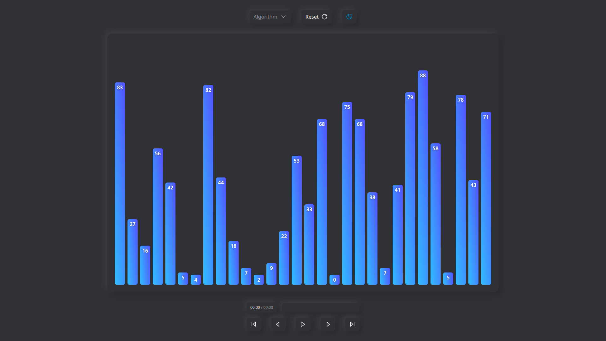

# Sorting Visualizer

A web application that visualizes multiple sorting algorithms, allowing users to observe their step-by-step execution.

- Bubble Sort
- Insertion Sort
- Merge Sort
- Quick Sort

**Live Demo:** [sorting.korazza.com](https://sorting.korazza.com)

## Features

- **Algorithm Visualization:** Visualize multiple sorting algorithms including Bubble Sort, Insertion Sort, Merge Sort, and Quick Sort.
- **Animation Control:**
    - Control the speed of the animation.
    - Step through the algorithm execution frame by frame (forward and backward).
    - Play, pause, and reset the animation at any point.
- **Responsive Design:** The application is designed to work smoothly on various screen sizes, from mobile devices to desktops.
- **Theme Support:** Includes both Dark and Light theme options for user preference.

## Tech Stack

This project is built with a modern web development stack:

- **Core:**
    - [React](https://reactjs.org/) - A JavaScript library for building user interfaces.
    - [TypeScript](https://www.typescriptlang.org/) - A typed superset of JavaScript that compiles to plain JavaScript.
    - [Vite](https://vitejs.dev/) - A fast build tool and development server.
- **Styling & UI:**
    - [Tailwind CSS](https://tailwindcss.com/) - A utility-first CSS framework for rapid UI development.
    - [Framer Motion](https://www.framer.com/motion/) - A production-ready motion library for React.
    - [Lucide React](https://lucide.dev/) - A simply beautiful and consistent icon toolkit.
- **Testing & Linting:**
    - [Vitest](https://vitest.dev/) - A blazing fast unit test framework powered by Vite.
    - [ESLint](https://eslint.org/) - A pluggable and configurable linter tool for identifying and reporting on patterns in JavaScript.
    - [Prettier](https://prettier.io/) - An opinionated code formatter.
- **Package Management:**
    - [pnpm](https://pnpm.io/) - Fast, disk space efficient package manager.

## Available Scripts

In the project directory, you can run the following commands:

-   **`pnpm dev`**
    Starts the development server on `http://localhost:5173` (or the next available port).

-   **`pnpm build`**
    Builds the application for production to the `dist` folder.
    It correctly bundles React in production mode and optimizes the build for the best performance.

-   **`pnpm lint`**
    Lints the codebase using ESLint to identify and fix problematic patterns in the code.

-   **`pnpm test`**
    Runs unit tests using Vitest in watch mode.

-   **`pnpm test --coverage`**
    Runs unit tests and generates a coverage report located in the `./coverage` directory.

-   **`pnpm preview`**
    Serves the production build from the `dist` folder locally for previewing before deployment.

---

*This README was last updated on YYYY-MM-DD.*
*(Consider replacing YYYY-MM-DD with the actual date or removing this line)*
